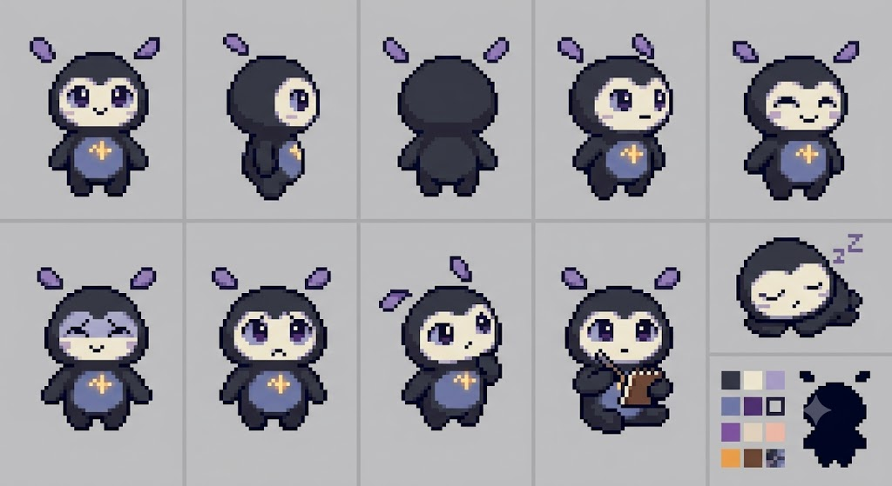

# Progress Journal

## BETA v0.2

Trading Buddy is currently in active development under the label **BETA v0.2**. This journal
records meaningful product and engineering milestones without pretending the application is
production-ready.

### June 29, 2026 - Task 11C real semantic QA checkpoint

- Completed a real 20-turn local-Qwen desktop conversation and genuine full-process restart.
- Verified installed `embeddinggemma:300m`: 768 finite normalized dimensions, bounded batch support,
  SQLite persistence, and semantic status `ready`.
- Added JSON-Schema-constrained consolidation, corrected background cancellation/races, and fixed
  irrelevant continuity injection.
- Proved post-restart paraphrase retrieval while an unrelated movie query returns no continuity.
- Passed 168 frontend tests, 88 Rust tests, formatting, lint, strict TypeScript, clippy, frontend
  build, and Tauri debug/release builds.
- Task 11 remains open because the final real run lacks a valid FarmTown episode/project entity,
  live correction/deletion, direct human pointer QA, and the complete performance/display matrix.
- Detailed handoff report:
  [`docs/reports/TASK-011C-c12-real-semantic-qa.md`](reports/TASK-011C-c12-real-semantic-qa.md)

### June 27, 2026 - Task 11B living-learning implementation checkpoint

- Finished the deterministic direct-interaction architecture, conservative moving-window
  following, persistent movement controls, animation intent, pose hitboxes/anchors, and Creature
  Lab.
- Added schema v9 continuity storage without replacing existing confirmed memories: summaries,
  episodes, entities/aliases/relationships, current-life context, embedding metadata/vectors,
  durable consolidation jobs, and retrieval usage.
- Added strict local-Qwen consolidation, startup job recovery, bounded retry/coalescing, loopback
  Ollama embeddings, lexical fallback, hybrid scoring, deterministic context budgeting, and
  visible-chat priority.
- Wired bounded continuity into Companion Home and the desktop bubble, including source/reason
  transparency, corrections/deletion, settings, retry/re-embed, and a Continuity Lab.
- Added deterministic listen, reflect, plan, hang-out, and presence modes plus versioned,
  inspectable identity state without affection, jealousy, guilt, or suffering mechanics.
- Passed a disk-backed FarmTown restart/paraphrase/correction/deletion test using synthetic vectors,
  167 frontend tests, 79 Rust tests, clippy, lint, typecheck, formatting, frontend build, and both
  Tauri debug/release builds.
- A real native launch confirmed buddy-first startup. Full manual drag/surface QA and real Ollama
  semantic restart QA remain open because `embeddinggemma:300m` is not installed; no model was
  silently downloaded.
- Detailed handoff report:
  [`docs/reports/TASK-011-living-learning-companion.md`](reports/TASK-011-living-learning-companion.md)

### June 26, 2026 - Task 11 C1/C2 living-body checkpoint

- Audited Task 10 accurately as M1/M2 only and postponed the proposed frontend redesign.
- Revalidated Shimeji as behavior-only inspiration and the current Odysseus `dev` branch as an
  AGPL architectural reference without copying code, prompts, schemas, tests, documentation, or
  assets.
- Added framework-independent 30 Hz fixed-timestep creature physics with walking, gravity,
  terminal velocity, landing, edge handling, drops, safe recovery, and negative-coordinate tests.
- Added native work-area clamping for restored and programmatic positions plus a durable Bring
  Buddy Back tray action.
- Added the coherent portion of C3: native drag ownership, monitor/window-top surfaces, bounded
  world refresh, and a seeded cooldown-based autonomous planner that works without Ollama.
- Verified a real debug desktop window falling to the monitor floor and autonomously walking
  horizontally. Direct manual drag/drop, moving-window following, multi-monitor/DPI checks,
  preference UI, and Creature Lab remain pending.
- C4-C12, including all learning-mind memory work, remain unclaimed.
- Detailed handoff report:
  [`docs/reports/TASK-011-living-learning-companion.md`](reports/TASK-011-living-learning-companion.md)

### June 26, 2026 - Task 10 M1/M2 creature-first reset

- Reset the product north star to a living local desktop creature with companion identity,
  conversation, continuity, routines, optional skills, and a secondary Companion Home.
- Paused Task 9E after its completed active-account checkpoint while preserving all read-only
  Hyperliquid functionality as an optional skill.
- Studied Shimeji as behavioral inspiration and the current Odysseus repository as an
  AGPL-3.0-or-later architectural reference; documented that no code, prompts, tests, art, or
  assets were copied.
- Updated Companion Home navigation to Companion, Conversations, Memory, Journal, Skills, Privacy,
  and Settings, and grouped Trading beneath Skills.
- Added a typed native desktop-world service for Windows monitor/work-area/scale geometry,
  geometry-only visible window rectangles, buddy/bubble exclusion, and explicit cursor opt-in.
- Added monitor-only fallback semantics for unsupported platforms and strict TypeScript boundary
  validation.
- Remaining Task 10 work begins at M3: deterministic movement/physics, drag/drop recovery, and
  bring-back hardening. M4-M13 remain unclaimed.
- Detailed handoff report:
  [`docs/reports/TASK-010-shimeji-body-odysseus-brain.md`](reports/TASK-010-shimeji-body-odysseus-brain.md)

### June 25, 2026 - Task 9E E1 active-account persistence checkpoint

- Moved the active Hyperliquid account selection from frontend browser storage into Rust-owned
  SQLite app settings.
- Added schema v7, typed read/update commands, invalid-selection repair, delete-clearing via
  foreign key, and sanitized cross-window account-selection events.
- Kept a one-time cleanup path for the old Task 9D browser key so there are not two durable sources
  of truth.
- Updated Companion Home, desktop bubble cards, and deterministic trading fact paths to read the
  active account from Rust.
- Remaining Task 9E work: official WebSocket research, live read-only sync, reconnect, HTTP
  reconciliation, trade-episode reconstruction, trading-session reconstruction, live UX, fixture
  lab, performance timings, and manual/live QA.
- Detailed handoff report:
  [`docs/reports/TASK-009E-live-sync-trade-reconstruction.md`](reports/TASK-009E-live-sync-trade-reconstruction.md)

### June 25, 2026 - Desktop trading awareness checkpoint

- Added shared active Hyperliquid account selection between Companion Home and the desktop bubble.
- Added compact read-only desktop bubble cards for account facts, positions, recent fills, funding,
  open orders, and sync progress.
- Added selected-account refresh/cancel controls without adding any order execution, signing,
  wallet, transfer, withdrawal, or generic RPC capability.
- Added deterministic trading intents, model-free execution refusal, exact string-based funding
  totals, and bounded local-Qwen trading context from saved facts only.
- Added Trading Lab context preview controls and frontend domain tests for the new non-native
  trading logic.
- Remaining follow-up: direct manual WebView QA for bubble cards and Trading Lab fixture smoke,
  machine-specific performance timing capture, and optional live public-address QA.
- Detailed handoff report:
  [`docs/reports/TASK-009D-desktop-trading-awareness.md`](reports/TASK-009D-desktop-trading-awareness.md)

### June 25, 2026 - Hyperliquid foundation hardening checkpoint

- Added SQLite schema v6 for fixture scenario identity instead of storing scenario names as display
  names.
- Added deterministic per-scenario fixture addresses, slow/cancel/performance fixture scenarios,
  active sync coalescing, progress state, cancellation, and cancelled/failed sync-run recording.
- Added a development-only Trading Lab for scenario creation, repeat sync, cancellation, and
  diagnostics.
- Tightened frontend trading intent detection and runtime guards for sync progress/diagnostics.
- Remaining follow-up: manual Trading Lab desktop QA, desktop bubble quick actions, bounded
  local-Qwen trading context, performance timing documentation, and optional live public-address QA.
- Detailed handoff report:
  [`docs/reports/TASK-009C-hyperliquid-foundation-hardening.md`](reports/TASK-009C-hyperliquid-foundation-hardening.md)

### June 25, 2026 - Read-only Hyperliquid provider foundation

- Added the first read-only Hyperliquid integration foundation with official allowlisted hosts,
  deterministic public-address validation, exact decimal-string handling, synthetic fixtures,
  SQLite schema v5, idempotent fixture sync, narrow Tauri commands, and a minimal Companion Home
  Trading section.
- Kept the boundary explicitly non-executing: no keys, seed phrases, signing, wallet SDKs, exchange
  secrets, order placement/cancellation, transfers, withdrawals, generic RPC/HTTP proxying, cloud,
  or telemetry.
- Documented remaining Task 9C work: Trading Lab, desktop buddy quick actions, bounded local-Qwen
  trading context, performance fixtures, manual desktop QA, and optional live public-address QA.
- Detailed handoff report:
  [`docs/reports/TASK-009B-hyperliquid-read-only-foundation.md`](reports/TASK-009B-hyperliquid-read-only-foundation.md)

### June 25, 2026 - BETA v0.2 label update

- Updated the current README and user-facing app labels from BETA v0.1 to BETA v0.2.
- Kept historical BETA v0.1 milestone reports and concept-art filenames intact.
- Detailed handoff report:
  [`docs/reports/TASK-009B-beta-v0.2-readme-label.md`](reports/TASK-009B-beta-v0.2-readme-label.md)

### June 25, 2026 - Conversational journaling foundation

- Verified that Task 8 was partially implemented in the worktree and stopped the Task 9
  Hyperliquid scope at the required gate.
- Added durable local journal entries with stable IDs, drafts, completed entries, `trading_session`
  kind, local FTS search, safe source links, tags, privacy flags, diagnostics, fixtures, and export.
- Added desktop-bubble journal sessions with deterministic journal intents and explicit save,
  draft, and discard controls.
- Added Companion Home journal library access and a development-only Journal Lab.
- Added frontend journal domain tests and Rust journal repository tests.
- Hyperliquid API research and trading integration work have not begun yet.
- Detailed handoff report:
  [`docs/reports/TASK-008-conversational-journaling-foundation.md`](reports/TASK-008-conversational-journaling-foundation.md)

### June 24, 2026 - Memory reliability hardening

- Added deterministic memory conflict classification for duplicate, update, conflict, and unrelated
  candidates.
- Added deterministic natural-language forgetting resolution for exact, ambiguous, category, all,
  and not-found requests.
- Added confirmed-update superseding behavior so old memories are replaced only when the update is
  confirmed.
- Added development-only Memory Lab diagnostics, 100/1,000 fixture generation, cleanup, and bounded
  retrieval timing.
- Moved memory listing filters into SQLite instead of loading all memory rows before filtering.
- Added restore/remove-expiry controls for rejected or temporary memories.
- Verified local Qwen availability through Ollama loopback and documented the remaining desktop
  UI automation gap.
- Detailed handoff report:
  [`docs/reports/TASK-007-memory-reliability-hardening.md`](reports/TASK-007-memory-reliability-hardening.md)

### June 24, 2026 - Transparent local companion memory

- Added local SQLite memory schema, typed preferences, FTS table, and usage records.
- Added deterministic explicit memory intents, pre-filtering, fake-secret rejection, and structured
  local-Qwen proposal validation.
- Added confirmed-memory retrieval and labelled memory context below the companion system prompt.
- Added memory proposal cards to the desktop bubble and Companion Home.
- Added **What Buddy Knows About Me** for memory inspection, search/filter/sort, settings,
  confirm/reject/edit/delete/delete-all, and separate memory export.
- Added frontend and Rust tests for memory domain logic, schema/repository behavior, retrieval
  exclusions, usage logging, provenance detachment, and export boundaries.
- Detailed handoff report:
  [`docs/reports/TASK-006-transparent-local-companion-memory.md`](reports/TASK-006-transparent-local-companion-memory.md)

### June 24, 2026 - Temporary buddy pose asset pack

- Moved the provided buddy reference image into `src/assets/buddy/source/`.
- Added a reproducible PNG extraction pipeline for ten transparent 128×128 pose assets.
- Added a typed pose manifest and deterministic visual-state-to-pose selection.
- Swapped the runtime buddy from the normal CSS placeholder to extracted pose PNGs with placeholder
  fallback.
- Added restrained temporary CSS motion over static poses.
- Expanded Companion Lab with pose previews, selected pose ID, scale/motion controls, natural
  dimensions, and fallback testing.
- Added image/manifest/pose-selection/renderer tests.
- Detailed handoff report:
  [`docs/reports/TASK-005B-temporary-buddy-pose-asset-pack.md`](reports/TASK-005B-temporary-buddy-pose-asset-pack.md)

### June 23, 2026 - Companion-first desktop shell

- Corrected the product hierarchy so the desktop buddy is primary and Companion Home is secondary.
- Added a separate attached conversation bubble window for compact desktop chat.
- Changed single-click buddy behavior to toggle the bubble instead of opening the full app.
- Added typed emotion/activity visual state, deterministic ambient life, proactive template gates,
  placement math, and OS idle-duration boundaries.
- Persisted companion preferences in Rust-owned settings.
- Expanded development tooling into Companion Lab previews.
- Documented deferred OS integrations: global shortcut, launch at login, native right-click buddy
  context menu, and user-facing docking controls.
- Detailed handoff report:
  [`docs/reports/TASK-005-companion-first-desktop-experience.md`](reports/TASK-005-companion-first-desktop-experience.md)

### June 23, 2026 - Desktop QA and storage UX hardening

- Added a Task 4 manual QA plan and QA journal for release-readiness work.
- Smoke-launched the real desktop app and verified app-local SQLite database creation.
- Added safe storage diagnostics and development-only Storage Lab controls.
- Hardened temporary chat mode, filename-only export feedback, retryable storage errors, and
  non-completed assistant message status display.
- Added frontend and Rust tests for storage diagnostics, display helpers, temporary chat behavior,
  filename-only export feedback, and interrupted-message recovery fixtures.
- Detailed handoff report:
  [`docs/reports/TASK-004-desktop-qa-storage-ux-hardening.md`](reports/TASK-004-desktop-qa-storage-ux-hardening.md)

### June 23, 2026 - Privacy-first local conversation storage

- Added Rust-owned SQLite persistence for saved conversations, visible messages, selected model,
  last-opened conversation, retention policy, and storage metadata.
- Added temporary chat mode for in-memory-only conversations.
- Added conversation management: new chat, list, switch, rename, archive, restore, delete, and
  delete-all.
- Added local JSON export through a native save-file dialog.
- Documented that the local database is not yet application-level encrypted.
- Automated verification passed, while full real-desktop manual verification remains pending.
- Detailed handoff report:
  [`docs/reports/TASK-003-privacy-first-local-conversation-storage.md`](reports/TASK-003-privacy-first-local-conversation-storage.md)

### June 23, 2026 — Visual direction captured

- Added the first buddy character concept board to the repository.
- Established the visual direction: rounded dark body, expressive face, floating antennae, and a
  warm glowing chest core.
- Added multiple reference moods and poses, including happy, curious, neutral, reading, and
  sleeping.
- Kept the running buddy CSS-based; the concept is not yet a production sprite sheet.
- Added the concept preview to Buddy Lab so visual development remains close to state testing.

### June 21, 2026 — First living local companion

- Connected the desktop application to local Ollama through a loopback-only Rust provider.
- Added installed-model discovery, selection, streaming responses, and cancellation.
- Verified a real local Qwen response through the complete desktop path.
- Added deterministic listening, thinking, talking, idle, concerned, and error buddy states.
- Added typed cross-window communication and development-only Buddy Lab controls.
- Confirmed that conversations remain session-only with no cloud service or database.

### June 20, 2026 — Desktop foundation

- Created the Tauri 2, React, TypeScript, Vite, and pnpm project foundation.
- Added the transparent always-on-top buddy and normal main application windows.
- Added tray controls, main-window focus behavior, and persisted buddy position.
- Established strict TypeScript, ESLint, Prettier, Vitest, React Testing Library, Rust tests, and
  project conventions.

## Next journal targets

- Refine the companion’s visual identity into original, production-ready sprites.
- Add verified OS global shortcut and launch-at-login integration.
- Add user-facing companion preference controls.
- Continue recording product decisions, verification results, and notable limitations here.
